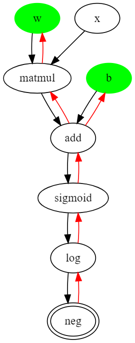

# Autograd

autograd is a automatic differentiation package that relies on operator overloading to dynamically build a computation graph and compute gradients during the backward pass. The package is implemented fully in Python and has no outside dependencies of any sort.

## Motivation

The goal of this project is to better understand the idea behind automatic differentiation that is present in basically every modern Deep Learning framework.

## Current state

Currently, autograd supports working with Python scalars or 1-D arrays of type `Vector`, which is part of the project. In the future, I plan to add support for multidimensional arrays. Another limitation is the lack of support for higher order gradients. Right now, it's my primary goal to add support for that. 

## Basic usage

Follow the steps below to install the package:

```
git clone git@github.com:mariosasko/autograd.git
cd autograd
pip install .
```

### Example

The example below shows how to compute the gradients of a binary logistic regression model. Since autograd builds the graph dynamically, it supports conditionals and loops in Python.

```
>>> import autograd as ag
>>> # model parameters
>>> w = ag.Variable(ag.Vector([-0.5, 0.3, 1]))
>>> b = ag.Variable(2)
>>> # data instance
>>> x = ag.Vector([10, 0.4, 3.5])
>>> y = 1
>>> # logistic regression model
>>> model = ag.sigmoid(w @ x + b)
>>> # binary cross entropy
>>> if y == 1:
...     loss = -ag.log(model)
>>> else:
...     loss = -ag.log(1 - model)
>>> # access the loss value (forward pass)
>>> loss.value
Vector(0.430446744029496)
>>> # compute the gradients
>>> ag.grad(loss)
>>> # access the gradients 
>>> w.grad
Vector([-3.49781451425635, -0.139912580570254, -1.2242350799897226])
>>> b.grad
Vector(-0.349781451425635)
```

and this the computation graph that `autograd` builds.



## References 

These are the references that were used to implement the package:

* [Atilim Gunes Baydin, Barak A. Pearlmutter, Alexey Andreyevich Radul, Jeffrey Mark Siskind: Automatic differentiation in machine learning: a survey](https://arxiv.org/pdf/1502.05767.pdf)
* [Charles C. Margossian: A Review of Automatic Differentiation and its Efficient Implementation](https://arxiv.org/pdf/1811.05031.pdf)
